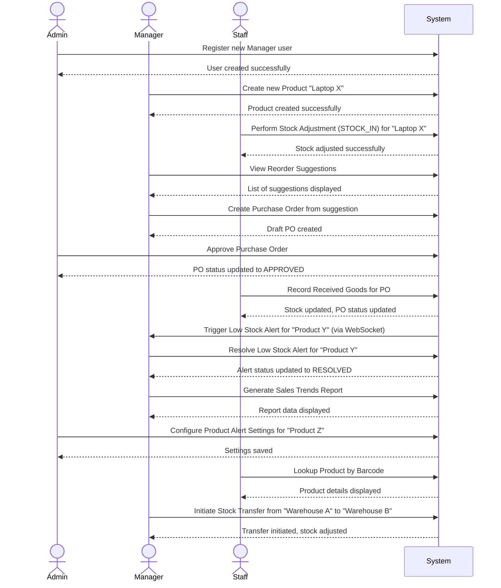
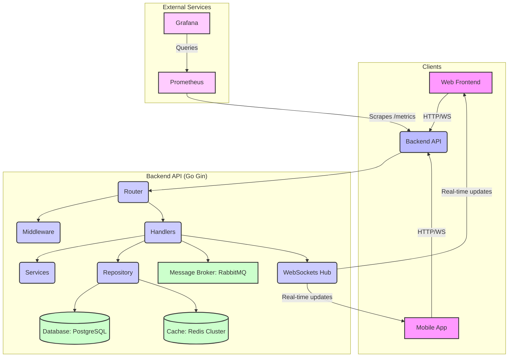

# Business Logic Document: Inventory Management System Backend

## 1. Overview

This document outlines the business logic and core functionalities of the Inventory Management System (IMS) backend. The IMS is designed to provide comprehensive tools for managing product inventory, tracking stock levels, handling replenishment, generating reports, and facilitating real-time communication. It supports multi-tenancy and various user roles to ensure secure and efficient operations.

## 2. Core Entities and Relationships

The system revolves around several key entities, which are interconnected to represent the complex relationships within an inventory management ecosystem. The following Entity-Relationship Diagram (ERD) illustrates these core entities and their relationships.

```mermaid
erDiagram
    Tenant ||--o{ User : "has"
    User ||--o{ StockAdjustment : "adjusted by"
    User ||--o{ PurchaseOrder : "created by"
    User ||--o{ StockTransfer : "transferred by"
    User ||--o{ UserNotificationSettings : "configures"
    User ||--o{ RefreshToken : "has"

    Category ||--o{ SubCategory : "has"
    Category ||--o{ Product : "categorizes"
    SubCategory ||--o{ Product : "sub-categorizes"

    Supplier ||--o{ Product : "supplies"
    Supplier ||--o{ PurchaseOrder : "receives orders from"
    Supplier ||--o{ ReorderSuggestion : "is suggested for"

    Location ||--o{ Product : "stored at"
    Location ||--o{ Batch : "contains"
    Location ||--o{ StockAdjustment : "occurs at"
    Location ||--o{ StockTransfer : "source location"
    Location ||--o{ StockTransfer : "destination location"

    Product ||--o{ Batch : "has stock in"
    Product ||--o{ StockAdjustment : "adjusts"
    Product ||--o{ Alert : "triggers"
    Product ||--o{ ProductAlertSettings : "configures alerts for"
    Product ||--o{ DemandForecast : "forecasts demand for"
    Product ||--o{ ReorderSuggestion : "suggests reorder for"
    Product ||--o{ PurchaseOrderItem : "is part of"
    Product ||--o{ StockTransfer : "transfers"

    Batch ||--o{ Alert : "related to"

    PurchaseOrder ||--o{ PurchaseOrderItem : "includes"

    Alert }|--|| Product : "for"
    Alert }|--o| Batch : "for optional"

    DemandForecast }|--|| Product : "for"
    ReorderSuggestion }|--|| Product : "for"
    ReorderSuggestion }|--|| Supplier : "from"

    PurchaseOrderItem }|--|| PurchaseOrder : "belongs to"
    PurchaseOrderItem }|--|| Product : "is"

    StockTransfer }|--|| Product : "transfers"
    StockTransfer }|--|| Location : "from source"
    StockTransfer }|--|| Location : "to destination"

    UserNotificationSettings }|--|| User : "for"
    ProductAlertSettings }|--|| Product : "for"

    Product {
        uint ID PK
        time_Time CreatedAt
        time_Time UpdatedAt
        time_Time DeletedAt
        string SKU "unique"
        string Name
        string Description
        uint CategoryID FK
        uint SubCategoryID FK
        uint SupplierID FK
        string Brand
        float64 PurchasePrice
        float64 SellingPrice
        string BarcodeUPC "unique"
        string ImageURLs
        string Status
        uint LocationID FK
    }

    Category {
        uint ID PK
        time_Time CreatedAt
        time_Time UpdatedAt
        time_Time DeletedAt
        string Name "unique"
    }

    SubCategory {
        uint ID PK
        time_Time CreatedAt
        time_Time UpdatedAt
        time_Time DeletedAt
        string Name
        uint CategoryID FK
    }

    Supplier {
        uint ID PK
        time_Time CreatedAt
        time_Time UpdatedAt
        time_Time DeletedAt
        string Name
        string ContactPerson
        string Email
        string Phone
        string Address
    }

    Location {
        uint ID PK
        time_Time CreatedAt
        time_Time UpdatedAt
        time_Time DeletedAt
        string Name "unique"
        string Address
    }

    Batch {
        uint ID PK
        time_Time CreatedAt
        time_Time UpdatedAt
        time_Time DeletedAt
        uint ProductID FK
        uint LocationID FK
        string BatchNumber
        int Quantity
        time_Time ExpiryDate
    }

    StockAdjustment {
        uint ID PK
        time_Time CreatedAt
        time_Time UpdatedAt
        time_Time DeletedAt
        uint ProductID FK
        uint LocationID FK
        string Type
        int Quantity
        string ReasonCode
        string Notes
        uint AdjustedBy FK
        time_Time AdjustedAt
        int PreviousQuantity
        int NewQuantity
    }

    Alert {
        uint ID PK
        time_Time CreatedAt
        time_Time UpdatedAt
        time_Time DeletedAt
        uint ProductID FK
        string Type
        string Message
        time_Time TriggeredAt
        string Status
        uint BatchID "FK optional"
    }

    User {
        uint ID PK
        time_Time CreatedAt
        time_Time UpdatedAt
        time_Time DeletedAt
        uint TenantID FK
        string Username "unique"
        string Password
        string Role
    }

    Tenant {
        uint ID PK
        time_Time CreatedAt
        time_Time UpdatedAt
        time_Time DeletedAt
        string Name "unique"
    }

    ProductAlertSettings {
        uint ID PK
        time_Time CreatedAt
        time_Time UpdatedAt
        time_Time DeletedAt
        uint ProductID FK
        int LowStockLevel
        int OverStockLevel
        int ExpiryAlertDays
    }

    UserNotificationSettings {
        uint ID PK
        time_Time CreatedAt
        time_Time UpdatedAt
        time_Time DeletedAt
        uint UserID FK
        bool EmailNotificationsEnabled
        bool SMSNotificationsEnabled
        string EmailAddress
        string PhoneNumber
    }

    DemandForecast {
        uint ID PK
        time_Time CreatedAt
        time_Time UpdatedAt
        time_Time DeletedAt
        uint ProductID FK
        string ForecastPeriod
        int PredictedDemand
        time_Time GeneratedAt
    }

    ReorderSuggestion {
        uint ID PK
        time_Time CreatedAt
        time_Time UpdatedAt
        time_Time DeletedAt
        uint ProductID FK
        uint SupplierID FK
        int CurrentStock
        int PredictedDemand
        int SuggestedOrderQuantity
        int LeadTimeDays
        string Status
        time_Time SuggestedAt
    }

    PurchaseOrder {
        uint ID PK
        time_Time CreatedAt
        time_Time UpdatedAt
        time_Time DeletedAt
        uint SupplierID FK
        string Status
        time_Time OrderDate
        time_Time ExpectedDeliveryDate
        time_Time ActualDeliveryDate
        uint CreatedBy FK
        uint ApprovedBy "FK optional"
        time_Time ApprovedAt "optional"
    }

    StockTransfer {
        uint ID PK
        time_Time CreatedAt
        time_Time UpdatedAt
        time_Time DeletedAt
        uint ProductID FK
        uint SourceLocationID FK
        uint DestLocationID FK
        int Quantity
        string Status
        uint TransferredBy FK
        time_Time TransferredAt
    }

    RefreshToken {
        uint ID PK
        time_Time CreatedAt
        time_Time UpdatedAt
        time_Time DeletedAt
        uint UserID FK
        string Token "unique"
        time_Time ExpiresAt
    }

    PurchaseOrderItem {
        uint ID PK
        time_Time CreatedAt
        time_Time UpdatedAt
        time_Time DeletedAt
        uint PurchaseOrderID FK
        uint ProductID FK
        int OrderedQuantity
        int ReceivedQuantity
        float64 UnitPrice
    }
```

## 3. Key Features and Modules

### User Management

*   **User Registration:** Allows new users to create accounts with specified roles (Admin, Manager, Staff).
*   **User Login:** Authenticates users and issues JWT access and refresh tokens.
*   **Token Refresh:** Provides a mechanism to obtain new access tokens using a valid refresh token.
*   **User Logout:** Invalidates active access and refresh tokens.
*   **User Profile Management:** Retrieve, update, and delete user details.
*   **Multi-tenancy:** Users are associated with a `TenantID`, enabling isolated data access for different organizations.

### Product Management

*   **Product Creation:** Add new products with details like SKU, name, description, category, supplier, pricing, barcode, image URLs, and initial location.
*   **Product Listing:** Retrieve a list of all products, with potential filtering options.
*   **Product Details:** View detailed information for a specific product.
*   **Product Update:** Modify existing product information.
*   **Product Deletion:** Remove products from the inventory (with checks for associated stock).
*   **Stock Level Inquiry:** Get current stock levels and batch breakdowns for a product.
*   **Stock History:** View a history of all stock adjustments for a product.

### Category Management

*   **Category Creation:** Define new product categories.
*   **Category Listing:** Retrieve a list of all categories, including their sub-categories.
*   **Category Details:** View details of a specific category.
*   **Category Update:** Modify existing category names.
*   **Category Deletion:** Remove categories (with checks for associated products or sub-categories).
*   **Sub-Category Management:** Create, list, get, update, and delete sub-categories associated with a main category.

### Supplier Management

*   **Supplier Creation:** Add new product suppliers with contact information.
*   **Supplier Listing:** Retrieve a list of all registered suppliers.
*   **Supplier Details:** View detailed information for a specific supplier.
*   **Supplier Update:** Modify existing supplier information.
*   **Supplier Deletion:** Remove suppliers (with checks for associated products or purchase orders).
*   **Supplier Performance Report:** Generate reports on supplier performance metrics (e.g., average lead time, on-time delivery rate).

### Location Management

*   **Location Creation:** Define new physical inventory locations (e.g., warehouses, stores).
*   **Location Listing:** Retrieve a list of all defined locations.
*   **Location Details:** View details of a specific location.
*   **Location Update:** Modify existing location information.
*   **Location Deletion:** Remove locations (with checks for associated products, batches, or stock adjustments).

### Stock Management

*   **Batch Management:** Add new stock with batch details (batch number, quantity, expiry date) to a product at a specific location.
*   **Manual Stock Adjustment:** Perform manual stock-in or stock-out operations for a product, with reasons and notes.
*   **Stock Transfer:** Facilitate the transfer of stock between different locations, automatically creating corresponding stock adjustments.

### Barcode Management

*   **Barcode Generation:** Generate barcode images (PNG) for products based on SKU or product ID.
*   **Barcode Lookup:** Retrieve product details by scanning or entering a barcode/UPC value.

### Replenishment Management

*   **Demand Forecasting:** Trigger the generation of demand forecasts for products based on historical sales data.
*   **Demand Forecast Inquiry:** Retrieve details of specific demand forecasts.
*   **Reorder Suggestions:** List suggested reorders based on demand forecasts and current stock levels.
*   **Purchase Order Creation from Suggestion:** Create draft purchase orders directly from reorder suggestions.
*   **Purchase Order Approval:** Approve draft purchase orders.
*   **Purchase Order Sending:** Mark approved purchase orders as sent to the supplier.
*   **Purchase Order Details:** Retrieve details of a specific purchase order, including its items.
*   **Purchase Order Update:** Modify details of a purchase order (only if in DRAFT status).
*   **Goods Receiving:** Record received quantities for items in a purchase order, updating stock levels and batch information.
*   **Purchase Order Cancellation:** Cancel purchase orders (if in DRAFT or APPROVED status).

### Reporting

*   **Sales Trends Report:** Generate reports on sales trends over a specified period, with optional filters by category and location.
*   **Inventory Turnover Report:** Generate reports on inventory turnover rate over a specified period.
*   **Profit Margin Report:** Generate reports on profit margins for products or categories over a specified period.

### Alerts and Notifications

*   **Product Alert Settings:** Configure low-stock, overstock, and expiry alert thresholds for individual products.
*   **Alert Listing:** Retrieve a list of all active or resolved stock-related alerts.
*   **Alert Details:** View detailed information for a specific alert.
*   **Alert Resolution:** Mark specific alerts as resolved.
*   **User Notification Settings:** Configure user preferences for email and SMS notifications.

### Bulk Operations

*   **Product Import Template:** Download a CSV/Excel template for bulk product import.
*   **Bulk Product Import:** Upload CSV/Excel files for creating or updating products in bulk, with job status tracking and confirmation.
*   **Bulk Product Export:** Export product data to CSV/Excel files, with filtering options and job status tracking.

### WebSockets

*   **Real-time Communication:** Provides a `/ws` endpoint for bidirectional communication, enabling real-time updates and notifications (e.g., for alerts, stock changes).

## 4. User Roles and Permissions

The system supports different user roles, each with specific permissions:

*   **Admin:** Full access to all features, including user management, system configuration, and all inventory operations.
*   **Manager:** Comprehensive access to inventory, product, category, supplier, location, replenishment, and reporting features. May have limited access to user management (e.g., managing staff accounts).
*   **Staff:** Limited access, primarily focused on day-to-day inventory operations such as stock adjustments, transfers, and viewing product/stock information.

Permissions are enforced through middleware (`AuthMiddleware`, `TenantMiddleware`) and potentially fine-grained authorization logic within handlers.

## 5. User Stories

Here are some example user stories illustrating how different roles interact with the system:

## 6. System Architecture

