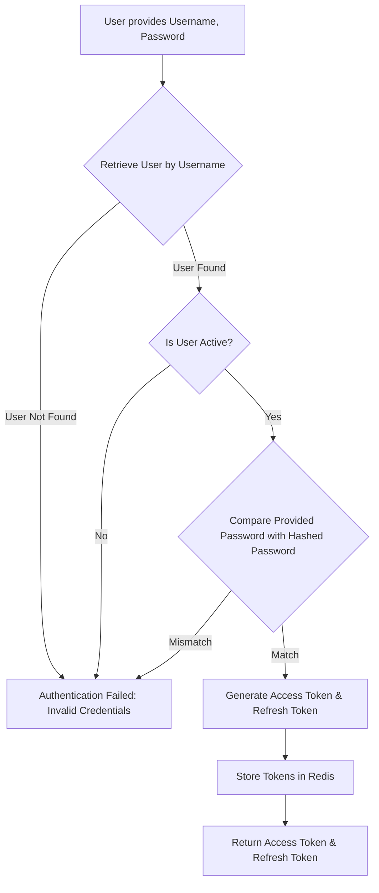
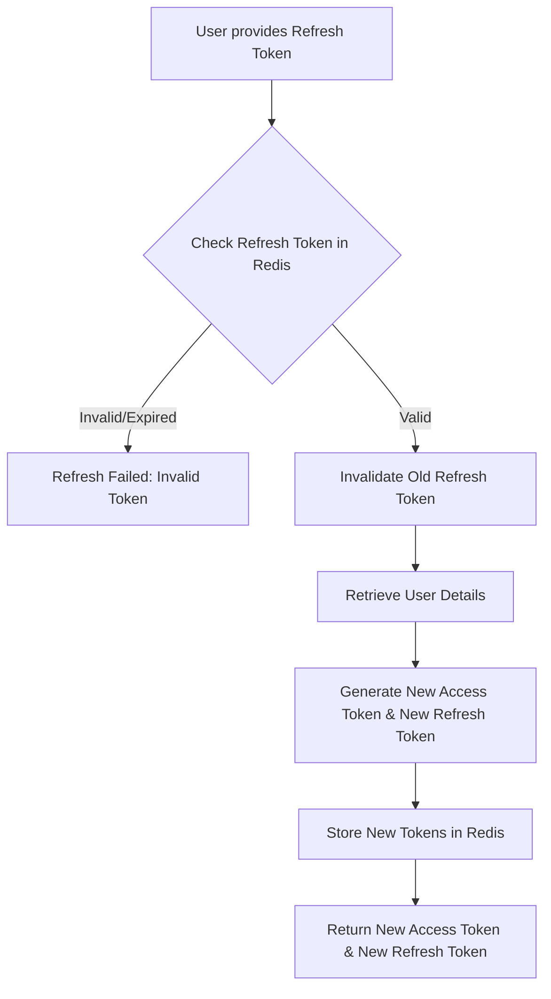
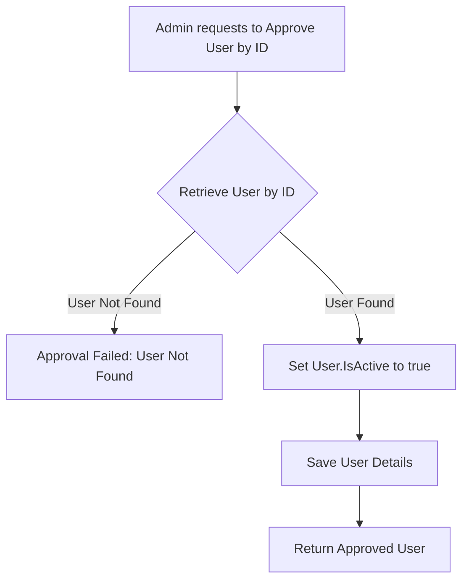
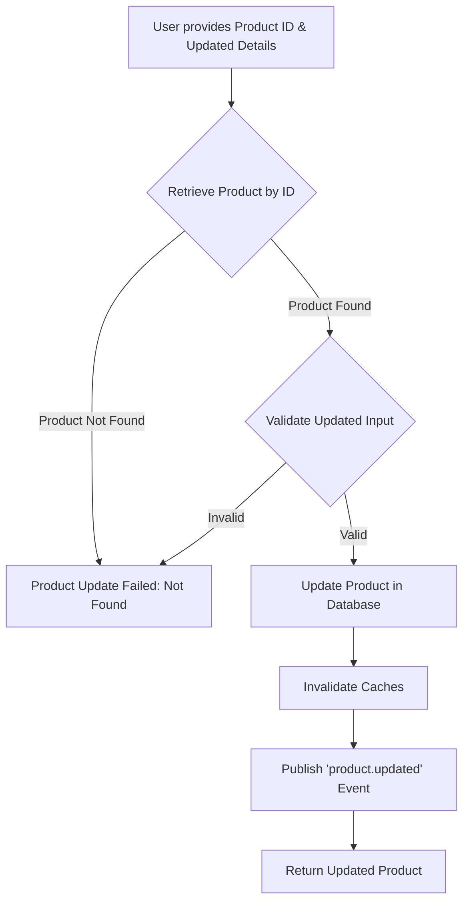
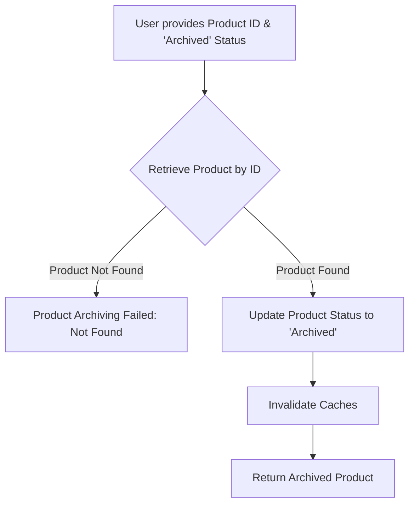
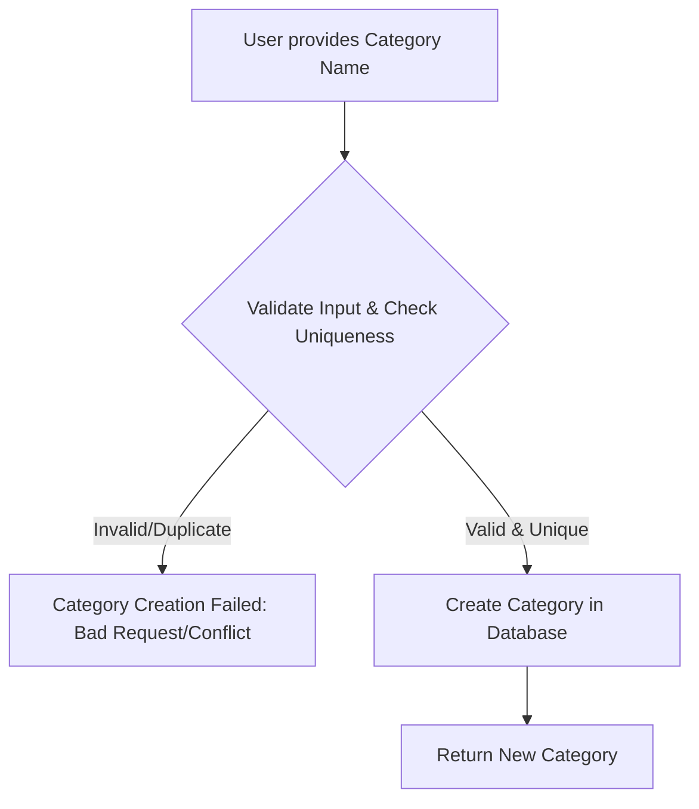
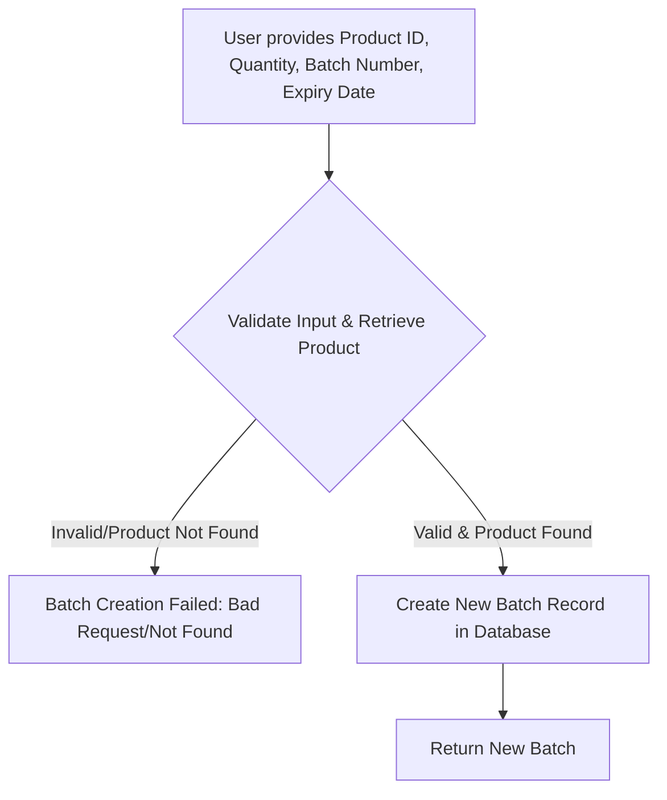

# Business Logic Details

This document outlines the detailed business logic and user stories for the Quantify inventory management system, feature by feature and scenario by scenario. Each scenario includes a Mermaid diagram for visual representation.

## Table of Contents
1.  [User Management & Authentication](#user-management--authentication)
    *   [Scenario: User Registration](#scenario-user-registration)
    *   [Scenario: User Login](#scenario-user-login)
    *   [Scenario: Refreshing Access Token](#scenario-refreshing-access-token)
    *   [Scenario: User Logout](#scenario-user-logout)
    *   [Scenario: Approving a New User](#scenario-approving-a-new-user)
2.  [Product Management](#product-management)
    *   [Scenario: Creating a New Product](#scenario-creating-a-new-product)
    *   [Scenario: Updating an Existing Product](#scenario-updating-an-existing-product)
    *   [Scenario: Deleting a Product](#scenario-deleting-a-product)
    *   [Scenario: Archiving a Product](#scenario-archiving-a-product)
3.  [Category Management](#category-management)
    *   [Scenario: Creating a New Category](#scenario-creating-a-new-category)
    *   [Scenario: Creating a New Sub-Category](#scenario-creating-a-new-sub-category)
    *   [Scenario: Deleting a Category with No Associations](#scenario-deleting-a-category-with-no-associations)
    *   [Scenario: Deleting a Category with Associated Products/Subcategories](#scenario-deleting-a-category-with-associated-productssubcategories)
4.  [Supplier Management](#supplier-management)
    *   [Scenario: Creating a New Supplier](#scenario-creating-a-new-supplier)
    *   [Scenario: Deleting a Supplier with Associated Products](#scenario-deleting-a-supplier-with-associated-products)
5.  [Location Management](#location-management)
    *   [Scenario: Creating a New Location](#scenario-creating-a-new-location)
    *   [Scenario: Deleting a Location with Associated Data](#scenario-deleting-a-location-with-associated-data)
6.  [Stock Management](#stock-management)
    *   [Scenario: Adding New Stock (Batch)](#scenario-adding-new-stock-batch)
    *   [Scenario: Performing a Manual Stock Adjustment (Stock-In)](#scenario-performing-a-manual-stock-adjustment-stock-in)
    *   [Scenario: Performing a Manual Stock Adjustment (Stock-Out)](#scenario-performing-a-manual-stock-adjustment-stock-out)
    *   [Scenario: Creating a Stock Transfer](#scenario-creating-a-stock-transfer)
7.  [Alerts & Notifications](#alerts--notifications)
    *   [Scenario: Configuring Product Alert Settings](#scenario-configuring-product-alert-settings)
    *   [Scenario: Automatic Low Stock Alert Triggering](#scenario-automatic-low-stock-alert-triggering)
    *   [Scenario: Resolving an Alert](#scenario-resolving-an-alert)
    *   [Scenario: Configuring User Notification Preferences](#scenario-configuring-user-notification-preferences)
8.  [Barcode Management](#barcode-management)
    *   [Scenario: Generating a Barcode for a Product](#scenario-generating-a-barcode-for-a-product)
    *   [Scenario: Looking Up a Product by Barcode](#scenario-looking-up-a-product-by-barcode)
9.  [Bulk Operations](#bulk-operations)
    *   [Scenario: Uploading a File for Bulk Product Import](#scenario-uploading-a-file-for-bulk-product-import)
    *   [Scenario: Confirming a Bulk Product Import](#scenario-confirming-a-bulk-product-import)
    *   [Scenario: Exporting Product Data](#scenario-exporting-product-data)
10. [Replenishment & Purchase Orders](#replenishment--purchase-orders)
    *   [Scenario: Generating Demand Forecast](#scenario-generating-demand-forecast)
    *   [Scenario: Creating a Purchase Order from a Reorder Suggestion](#scenario-creating-a-purchase-order-from-a-reorder-suggestion)
    *   [Scenario: Approving a Purchase Order](#scenario-approving-a-purchase-order)
    *   [Scenario: Sending a Purchase Order](#scenario-sending-a-purchase-order)
    *   [Scenario: Receiving Goods for a Purchase Order](#scenario-receiving-goods-for-a-purchase-order)
    *   [Scenario: Cancelling a Purchase Order](#scenario-cancelling-a-purchase-order)
11. [Reporting](#reporting)
    *   [Scenario: Generating Sales Trends Report](#scenario-generating-sales-trends-report)
    *   [Scenario: Generating Inventory Turnover Report](#scenario-generating-inventory-turnover-report)
    *   [Scenario: Generating Profit Margin Report](#scenario-generating-profit-margin-report)
    *   [Scenario: Generating Supplier Performance Report](#scenario-generating-supplier-performance-report)

---

## 1. User Management & Authentication

This feature set handles user registration, login, session management (via JWT and refresh tokens), and user account administration.

### Scenario: User Registration

**User Story:** As a new user, I want to register an account so I can access the system. If I am the very first user, I should be registered as an 'Admin' and be active immediately. Subsequent users should be inactive by default and require approval.

**Business Logic:**
*   A new user provides a username, password, and role.
*   The password is hashed using bcrypt.
*   If no users exist in the system, the first registered user *must* have the 'Admin' role and their `IsActive` status is set to `true`.
*   If users already exist, the new user's `IsActive` status is set to `false` by default, requiring an administrator to approve them.
*   The new user account is stored in the database.

```mermaid
graph TD
    A[User provides Username, Password, Role] --> B{Check if any user exists?};
    B -- No --> C{Set Role to 'Admin', IsActive to true};
    B -- Yes --> D{Set IsActive to false};
    C --> E[Hash Password];
    D --> E;
    E --> F[Store User in Database];
    F --> G{Return New User (without password)};
```

### Scenario: User Login

**User Story:** As a registered user, I want to log in using my credentials to gain access to the system.

**Business Logic:**
*   A user provides a username and password.
*   The system retrieves the user by username.
*   If the user is not found, authentication fails.
*   If the user is found but `IsActive` is `false`, authentication fails (account not approved).
*   The provided password is compared with the stored hashed password.
*   If passwords match, an access token (short-lived) and a refresh token (long-lived) are generated.
*   Both tokens are stored in Redis with their respective expiration times.
*   The tokens are returned to the user.



### Scenario: Refreshing Access Token

**User Story:** As a logged-in user, I want to refresh my access token using my refresh token so I can continue using the system without re-logging in.

**Business Logic:**
*   A user provides a refresh token.
*   The system checks if the refresh token exists in Redis.
*   If the refresh token is invalid or expired, the request fails.
*   The old refresh token is invalidated (deleted from Redis).
*   A new access token and a new refresh token are generated.
*   Both new tokens are stored in Redis with their respective expiration times.
*   The new tokens are returned to the user.



### Scenario: User Logout

**User Story:** As a logged-in user, I want to log out of the system to invalidate my session.

**Business Logic:**
*   A user provides their refresh token.
*   The system invalidates (deletes from Redis) the provided refresh token.
*   The system attempts to invalidate the associated access token (if present in the Authorization header).
*   A success message is returned.

```mermaid
graph TD
    A[User provides Refresh Token] --> B[Invalidate Refresh Token in Redis];
    B --> C[Invalidate Access Token (if present)];
    C --> D[Return Logout Success];
```

### Scenario: Approving a New User

**User Story:** As an administrator, I want to approve a newly registered user so they can log in and use the system.

**Business Logic:**
*   An administrator requests to approve a user by their ID.
*   The system retrieves the user by ID.
*   If the user is not found, the request fails.
*   The `IsActive` status of the user is set to `true`.
*   The updated user details are saved.



---

## 2. Product Management

This feature set allows for the creation, viewing, updating, and deletion of products within the inventory.

### Scenario: Creating a New Product

**User Story:** As an inventory manager, I want to add a new product to the system with all its relevant details.

**Business Logic:**
*   A user provides product details: SKU, Name, Description, CategoryID, SubCategoryID, SupplierID, Brand, PurchasePrice, SellingPrice, BarcodeUPC, ImageURLs, Status, LocationID.
*   The system validates the input (e.g., required fields, valid IDs for Category, Supplier, Location).
*   Checks for uniqueness of SKU and BarcodeUPC.
*   The new product is created in the database.
*   Relevant caches (e.g., product list, specific product cache) are invalidated.
*   A `product.created` event is published to the message broker.

```mermaid
graph TD
    A[User provides Product Details] --> B{Validate Input & Check Uniqueness (SKU, BarcodeUPC)};
    B -- Invalid/Duplicate --> C[Product Creation Failed: Bad Request/Conflict];
    B -- Valid & Unique --> D[Create Product in Database];
    D --> E[Invalidate Caches];
    E --> F[Publish 'product.created' Event];
    F --> G[Return New Product];
```

### Scenario: Updating an Existing Product

**User Story:** As an inventory manager, I want to modify the details of an existing product.

**Business Logic:**
*   A user provides the Product ID and updated product details.
*   The system retrieves the product by ID.
*   If the product is not found, the request fails.
*   The system validates the updated input.
*   The product's details are updated in the database.
*   Relevant caches are invalidated.
*   A `product.updated` event is published to the message broker.



### Scenario: Deleting a Product

**User Story:** As an inventory manager, I want to remove a product from the system, provided it has no associated stock or adjustments.

**Business Logic:**
*   A user provides the Product ID.
*   The system retrieves the product by ID.
*   If the product is not found, the request fails.
*   The system checks for associated batches and stock adjustments.
*   If associated data exists, the deletion is prevented (conflict).
*   If no associated data, the product is deleted from the database.
*   Relevant caches are invalidated.
*   A `product.deleted` event is published to the message broker.

```mermaid
graph TD
    A[User provides Product ID] --> B{Retrieve Product by ID};
    B -- Product Not Found --> C[Product Deletion Failed: Not Found];
    B -- Product Found --> D{Check for Associated Batches/Stock Adjustments};
    D -- Associated Data Exists --> E[Product Deletion Failed: Conflict];
    D -- No Associated Data --> F[Delete Product from Database];
    F --> G[Invalidate Caches];
    G --> H[Publish 'product.deleted' Event];
    H --> I[Return Success (No Content)];
```

### Scenario: Archiving a Product

**User Story:** As an inventory manager, I want to archive a product instead of permanently deleting it, making it inactive but retaining its history.

**Business Logic:**
*   A user provides the Product ID and requests to set its status to 'Archived'.
*   The system retrieves the product by ID.
*   If the product is not found, the request fails.
*   The product's `Status` field is updated to 'Archived'.
*   Relevant caches are invalidated.



---

## 3. Category Management

This feature set allows for the organization of products into categories and sub-categories.

### Scenario: Creating a New Category

**User Story:** As an inventory manager, I want to create a new product category to better organize my inventory.

**Business Logic:**
*   A user provides a category name.
*   The system validates the input (e.g., required name).
*   Checks for uniqueness of the category name.
*   The new category is created in the database.



### Scenario: Creating a New Sub-Category

**User Story:** As an inventory manager, I want to create a new sub-category under an existing category to further refine product organization.

**Business Logic:**
*   A user provides the Parent Category ID and a sub-category name.
*   The system validates the input (e.g., required name, valid Category ID).
*   Retrieves the parent category to ensure it exists.
*   The new sub-category is created, linked to its parent category.

```mermaid
graph TD
    A[User provides Parent Category ID & Sub-Category Name] --> B{Validate Input & Retrieve Parent Category};
    B -- Invalid/Category Not Found --> C[Sub-Category Creation Failed: Bad Request/Not Found];
    B -- Valid & Category Found --> D[Create Sub-Category in Database (linked to Parent)];
    D --> E[Return New Sub-Category];
```

### Scenario: Deleting a Category with No Associations

**User Story:** As an inventory manager, I want to delete a category that is no longer needed, provided no products or subcategories are linked to it.

**Business Logic:**
*   A user provides the Category ID.
*   The system retrieves the category by ID.
*   If the category is not found, the request fails.
*   The system checks for associated products. If found, deletion is prevented.
*   The system checks for associated subcategories. If found, deletion is prevented.
*   If no associations, the category is deleted from the database.

```mermaid
graph TD
    A[User provides Category ID] --> B{Retrieve Category by ID};
    B -- Category Not Found --> C[Category Deletion Failed: Not Found];
    B -- Category Found --> D{Check for Associated Products?};
    D -- Yes --> E[Deletion Failed: Products Associated];
    D -- No --> F{Check for Associated Subcategories?};
    F -- Yes --> G[Deletion Failed: Subcategories Associated];
    F -- No --> H[Delete Category from Database];
    H --> I[Return Success (No Content)];
```

### Scenario: Deleting a Category with Associated Products/Subcategories

**User Story:** As an inventory manager, I attempt to delete a category that still has products or subcategories linked to it.

**Business Logic:**
*   A user provides the Category ID.
*   The system retrieves the category by ID.
*   If the category is not found, the request fails.
*   The system checks for associated products. If found, the process stops and returns a conflict error.
*   If no associated products, it checks for associated subcategories. If found, the process stops and returns a conflict error.
*   If neither is found, the category is deleted.

```mermaid
graph TD
    A[User provides Category ID] --> B{Retrieve Category by ID};
    B -- Category Not Found --> C[Category Deletion Failed: Not Found];
    B -- Category Found --> D{Check for Associated Products?};
    D -- Yes --> E[Deletion Failed: Conflict (Products Associated)];
    D -- No --> F{Check for Associated Subcategories?};
    F -- Yes --> G[Deletion Failed: Conflict (Subcategories Associated)];
    F -- No --> H[Delete Category from Database];
    H --> I[Return Success (No Content)];
```

---

## 4. Supplier Management

This feature set handles the creation, viewing, updating, and deletion of product suppliers.

### Scenario: Creating a New Supplier

**User Story:** As an inventory manager, I want to add a new supplier to the system with their contact information.

**Business Logic:**
*   A user provides supplier details: Name, ContactPerson, Email, Phone, Address.
*   The system validates the input (e.g., required name).
*   Checks for uniqueness of the supplier name.
*   The new supplier is created in the database.

```mermaid
graph TD
    A[User provides Supplier Details] --> B{Validate Input & Check Uniqueness (Name)};
    B -- Invalid/Duplicate --> C[Supplier Creation Failed: Bad Request/Conflict];
    B -- Valid & Unique --> D[Create Supplier in Database];
    D --> E[Return New Supplier];
```

### Scenario: Deleting a Supplier with Associated Products

**User Story:** As an inventory manager, I attempt to delete a supplier that still has products linked to them.

**Business Logic:**
*   A user provides the Supplier ID.
*   The system retrieves the supplier by ID.
*   If the supplier is not found, the request fails.
*   The system checks for associated products.
*   If associated products are found, the deletion is prevented (conflict).
*   If no associated products, the supplier is deleted from the database.

```mermaid
graph TD
    A[User provides Supplier ID] --> B{Retrieve Supplier by ID};
    B -- Supplier Not Found --> C[Supplier Deletion Failed: Not Found];
    B -- Supplier Found --> D{Check for Associated Products?};
    D -- Yes --> E[Deletion Failed: Conflict (Products Associated)];
    D -- No --> F[Delete Supplier from Database];
    F --> G[Return Success (No Content)];
```

---

## 5. Location Management

This feature set manages physical inventory locations like warehouses or stores.

### Scenario: Creating a New Location

**User Story:** As an inventory manager, I want to add a new physical location where inventory is stored.

**Business Logic:**
*   A user provides location details: Name, Address.
*   The system validates the input (e.g., required name).
*   Checks for uniqueness of the location name.
*   The new location is created in the database.

```mermaid
graph TD
    A[User provides Location Details] --> B{Validate Input & Check Uniqueness (Name)};
    B -- Invalid/Duplicate --> C[Location Creation Failed: Bad Request/Conflict];
    B -- Valid & Unique --> D[Create Location in Database];
    D --> E[Return New Location];
```

### Scenario: Deleting a Location with Associated Data

**User Story:** As an inventory manager, I attempt to delete a location that still has products, batches, or stock adjustments linked to it.

**Business Logic:**
*   A user provides the Location ID.
*   The system retrieves the location by ID.
*   If the location is not found, the request fails.
*   The system checks for associated products. If found, deletion is prevented.
*   The system checks for associated batches. If found, deletion is prevented.
*   The system checks for associated stock adjustments. If found, deletion is prevented.
*   If no associations, the location is deleted from the database.

```mermaid
graph TD
    A[User provides Location ID] --> B{Retrieve Location by ID};
    B -- Location Not Found --> C[Location Deletion Failed: Not Found];
    B -- Location Found --> D{Check for Associated Products?};
    D -- Yes --> E[Deletion Failed: Conflict (Products Associated)];
    D -- No --> F{Check for Associated Batches?};
    F -- Yes --> G[Deletion Failed: Conflict (Batches Associated)];
    F -- No --> H{Check for Associated Stock Adjustments?};
    H -- Yes --> I[Deletion Failed: Conflict (Adjustments Associated)];
    H -- No --> J[Delete Location from Database];
    J --> K[Return Success (No Content)];
```

---

## 6. Stock Management

This feature set covers managing product stock levels, including adding new batches, making adjustments, and transferring stock between locations.

### Scenario: Adding New Stock (Batch)

**User Story:** As a warehouse staff, I want to add new stock for a product, specifying batch details and quantity.

**Business Logic:**
*   A user provides Product ID, Quantity, Batch Number, and optional Expiry Date.
*   The system validates input and retrieves the product to ensure it exists.
*   A new `Batch` record is created in the database, associated with the product and its default location.



### Scenario: Performing a Manual Stock Adjustment (Stock-In)

**User Story:** As a warehouse staff, I want to manually increase the stock of a product due to reasons like returns or discovery of misplaced items.

**Business Logic:**
*   A user provides Product ID, Quantity, Reason Code, and Notes for a 'STOCK_IN' adjustment.
*   The system validates input and retrieves the product.
*   A database transaction is started.
*   The current stock quantity for the product is recorded.
*   A new batch is created for the incoming stock (for simplicity, a new manual batch).
*   A `StockAdjustment` record is created with type 'STOCK_IN', recording previous and new quantities.
*   The transaction is committed.
*   A `stock.adjusted` event is published.

```mermaid
graph TD
    A[User provides Product ID, Quantity, Reason, Notes (STOCK_IN)] --> B{Validate Input & Retrieve Product};
    B -- Invalid/Product Not Found --> C[Adjustment Failed: Bad Request/Not Found];
    B -- Valid & Product Found --> D[Start DB Transaction];
    D --> E[Record Current Stock Quantity];
    E --> F[Create New Batch for Stock-In];
    F --> G[Create StockAdjustment Record (STOCK_IN)];
    G --> H[Commit DB Transaction];
    H --> I[Publish 'stock.adjusted' Event];
    I --> J[Return Success];
```

### Scenario: Performing a Manual Stock Adjustment (Stock-Out)

**User Story:** As a warehouse staff, I want to manually decrease the stock of a product due to reasons like damage, theft, or samples.

**Business Logic:**
*   A user provides Product ID, Quantity, Reason Code, and Notes for a 'STOCK_OUT' adjustment.
*   The system validates input and retrieves the product.
*   A database transaction is started.
*   The current stock quantity for the product is recorded.
*   The system checks if sufficient stock is available. If not, the transaction is rolled back.
*   Stock is reduced from existing batches (simplified FIFO/FEFO logic).
*   A `StockAdjustment` record is created with type 'STOCK_OUT', recording previous and new quantities.
*   The transaction is committed.
*   A `stock.adjusted` event is published.

```mermaid
graph TD
    A[User provides Product ID, Quantity, Reason, Notes (STOCK_OUT)] --> B{Validate Input & Retrieve Product};
    B -- Invalid/Product Not Found --> C[Adjustment Failed: Bad Request/Not Found];
    B -- Valid & Product Found --> D[Start DB Transaction];
    D --> E[Record Current Stock Quantity];
    E --> F{Is Sufficient Stock Available?};
    F -- No --> G[Adjustment Failed: Insufficient Stock (Rollback)];
    F -- Yes --> H[Reduce Stock from Existing Batches];
    H --> I[Create StockAdjustment Record (STOCK_OUT)];
    I --> J[Commit DB Transaction];
    J --> K[Publish 'stock.adjusted' Event];
    K --> L[Return Success];
```

### Scenario: Creating a Stock Transfer

**User Story:** As a logistics manager, I want to transfer a specific quantity of a product from one location to another.

**Business Logic:**
*   A user provides Product ID, Source Location ID, Destination Location ID, and Quantity.
*   The system validates input (e.g., valid IDs, quantity > 0).
*   A database transaction is started.
*   A `StockTransfer` record is created.
*   A `StockAdjustment` of type 'STOCK_OUT' is created for the source location.
*   A `StockAdjustment` of type 'STOCK_IN' is created for the destination location.
*   The transaction is committed.

```mermaid
graph TD
    A[User provides Product ID, Source Location, Dest Location, Quantity] --> B{Validate Input};
    B -- Invalid --> C[Transfer Failed: Bad Request];
    B -- Valid --> D[Start DB Transaction];
    D --> E[Create StockTransfer Record];
    E --> F[Create STOCK_OUT Adjustment for Source Location];
    F --> G[Create STOCK_IN Adjustment for Destination Location];
    G --> H[Commit DB Transaction];
    H --> I[Return New Stock Transfer];
```

---

## 7. Alerts & Notifications

This feature set allows users to configure alerts for stock levels and receive notifications.

### Scenario: Configuring Product Alert Settings

**User Story:** As an inventory manager, I want to set up thresholds for low stock, overstock, and expiry alerts for a specific product.

**Business Logic:**
*   A user provides Product ID and alert thresholds (LowStockLevel, OverStockLevel, ExpiryAlertDays).
*   The system validates input and retrieves the product.
*   The `ProductAlertSettings` are upserted (created if not exists, updated if exists) in the database for the given product.

```mermaid
graph TD
    A[User provides Product ID & Alert Thresholds] --> B{Validate Input & Retrieve Product};
    B -- Invalid/Product Not Found --> C[Configuration Failed: Bad Request/Not Found];
    B -- Valid & Product Found --> D[Upsert ProductAlertSettings in Database];
    D --> E[Return Updated Settings];
```

### Scenario: Automatic Low Stock Alert Triggering

**User Story:** As an inventory manager, I want the system to automatically generate an alert when a product's stock falls below its configured low stock threshold.

**Business Logic:**
*   A background process periodically runs `CheckAndTriggerAlerts`.
*   For each product with configured alert settings:
    *   The current quantity is retrieved.
    *   If `currentQuantity <= LowStockLevel` and no active 'LOW_STOCK' alert exists for this product, a new 'LOW_STOCK' alert is created.
    *   The new alert is stored in the database.
    *   A `alert.triggered` event is published to the message broker.

```mermaid
graph TD
    A[Background Process: CheckAndTriggerAlerts] --> B{Fetch All ProductAlertSettings};
    B --> C{For Each Setting:};
    C --> D[Get Current Product Quantity];
    D --> E{Is Current Quantity <= LowStockLevel?};
    E -- Yes --> F{Is Active LOW_STOCK Alert for Product?};
    F -- No --> G[Create New LOW_STOCK Alert Record];
    G --> H[Publish 'alert.triggered' Event];
    H --> I[Continue to next product/alert type];
    F -- Yes --> I;
    E -- No --> I;
    C --> J[End Process];
```

### Scenario: Resolving an Alert

**User Story:** As an inventory manager, I want to mark an active alert as resolved once the underlying issue has been addressed.

**Business Logic:**
*   A user provides the Alert ID.
*   The system retrieves the alert by ID.
*   If the alert is not found, the request fails.
*   If the alert is already 'RESOLVED', no action is taken.
*   The alert's `Status` is updated to 'RESOLVED' in the database.

```mermaid
graph TD
    A[User provides Alert ID] --> B{Retrieve Alert by ID};
    B -- Alert Not Found --> C[Resolution Failed: Not Found];
    B -- Alert Found --> D{Is Alert Already RESOLVED?};
    D -- Yes --> E[Return Alert (Already Resolved)];
    D -- No --> F[Update Alert Status to 'RESOLVED'];
    F --> G[Return Resolved Alert];
```

### Scenario: Configuring User Notification Preferences

**User Story:** As a user, I want to configure whether I receive email or SMS notifications for system alerts.

**Business Logic:**
*   A user provides their User ID and notification preferences (EmailNotificationsEnabled, SMSNotificationsEnabled, EmailAddress, PhoneNumber).
*   The system validates input and ensures the user exists.
*   The `UserNotificationSettings` are upserted (created if not exists, updated if exists) in the database for the given user.

```mermaid
graph TD
    A[User provides User ID & Notification Preferences] --> B{Validate Input & Ensure User Exists};
    B -- Invalid/User Not Found --> C[Configuration Failed: Bad Request/Not Found];
    B -- Valid & User Found --> D[Upsert UserNotificationSettings in Database];
    D --> E[Return Updated Settings];
```

---

## 8. Barcode Management

This feature set provides functionality for generating and using barcodes for products.

### Scenario: Generating a Barcode for a Product

**User Story:** As an inventory manager, I want to generate a barcode image for a product using its SKU or existing BarcodeUPC.

**Business Logic:**
*   A user provides either a Product SKU or Product ID.
*   The system retrieves the product using the provided identifier.
*   If the product is not found, the request fails.
*   The content for the barcode is determined (preferably `BarcodeUPC`, falling back to `SKU`).
*   A Code128 barcode is generated and scaled.
*   The barcode image is encoded as PNG and returned.

```mermaid
graph TD
    A[User provides Product SKU or Product ID] --> B{Retrieve Product by SKU/ID};
    B -- Product Not Found --> C[Barcode Generation Failed: Not Found];
    B -- Product Found --> D[Determine Barcode Content (BarcodeUPC or SKU)];
    D --> E[Generate Code128 Barcode];
    E --> F[Scale Barcode];
    F --> G[Encode Barcode to PNG];
    G --> H[Return Barcode Image (PNG)];
```

### Scenario: Looking Up a Product by Barcode

**User Story:** As a warehouse staff, I want to quickly find product details by scanning its barcode.

**Business Logic:**
*   A user provides a barcode value.
*   The system validates that a barcode value is provided.
*   The system searches for a product matching the barcode value in either `SKU` or `BarcodeUPC` fields.
*   If a product is found, its details (including category, supplier, location) are returned.
*   If no product is found, the request fails.

```mermaid
graph TD
    A[User provides Barcode Value] --> B{Validate Barcode Value};
    B -- Invalid --> C[Product Lookup Failed: Bad Request];
    B -- Valid --> D{Search Product by BarcodeValue (SKU or BarcodeUPC)};
    D -- Product Not Found --> E[Product Lookup Failed: Not Found];
    D -- Product Found --> F[Return Product Details];
```

---

## 9. Bulk Operations

This feature set enables bulk import and export of product data.

### Scenario: Uploading a File for Bulk Product Import

**User Story:** As an inventory manager, I want to upload a CSV/Excel file containing product data for bulk creation or update.

**Business Logic:**
*   A user uploads a CSV/Excel file.
*   The system saves the uploaded file temporarily.
*   A unique `jobID` is generated.
*   The `userID` of the uploader is retrieved from the context.
*   A `bulk.import` event is published to the message broker, containing the `jobID`, file path, and `userID`.
*   A mock job status is created and returned, indicating the job is 'QUEUED'.

```mermaid
graph TD
    A[User uploads CSV/Excel File] --> B[Save File Temporarily];
    B --> C[Generate Job ID];
    C --> D[Retrieve User ID from Context];
    D --> E[Publish 'bulk.import' Event to Message Broker];
    E --> F[Return Job Status (QUEUED)];
```

### Scenario: Confirming a Bulk Product Import

**User Story:** As an inventory manager, after reviewing a preview of a bulk import, I want to confirm and execute the import.

**Business Logic:**
*   A user provides the `jobID` for a bulk import.
*   The system retrieves the job status from mock storage.
*   If the job is not found or not in 'PENDING_CONFIRMATION' status, the request fails.
*   The `userID` of the confirmer is retrieved from the context.
*   A `bulk.import` event is published to the message broker (re-publishing with confirmation intent).
*   The job status is updated to 'PROCESSING' and returned.

```mermaid
graph TD
    A[User provides Job ID for Confirmation] --> B{Retrieve Job Status};
    B -- Job Not Found/Not PENDING_CONFIRMATION --> C[Confirmation Failed: Bad Request/Not Found];
    B -- Job Found & PENDING_CONFIRMATION --> D[Retrieve User ID from Context];
    D --> E[Publish 'bulk.import' Event (Confirmation)];
    E --> F[Update Job Status to 'PROCESSING'];
    F --> G[Return Confirmation Status];
```

### Scenario: Exporting Product Data

**User Story:** As an inventory manager, I want to export product data (all or filtered) to a CSV or Excel file.

**Business Logic:**
*   A user specifies the export format (CSV/Excel) and optional filters (category, supplier).
*   The `userID` of the exporter is retrieved from the context.
*   A unique `jobID` is generated.
*   A `bulk.export` event is published to the message broker, containing the `jobID`, format, filters, and `userID`.
*   A job status is returned, indicating the export is 'QUEUED'. (The actual export file generation and delivery would be handled by a background worker consuming this event).

```mermaid
graph TD
    A[User specifies Export Format & Filters] --> B[Retrieve User ID from Context];
    B --> C[Generate Job ID];
    C --> D[Publish 'bulk.export' Event to Message Broker];
    D --> E[Return Job Status (QUEUED)];
```

---

## 10. Replenishment & Purchase Orders

This feature set manages demand forecasting, reorder suggestions, and the lifecycle of purchase orders.

### Scenario: Generating Demand Forecast

**User Story:** As a replenishment manager, I want to generate a demand forecast for a specific product or all products over a given period.

**Business Logic:**
*   A user provides a `PeriodInDays` and an optional `ProductID`.
*   The system retrieves sales data for the specified product(s) over the given period.
*   A weighted average calculation is performed on historical sales data to predict future demand.
*   A `DemandForecast` record is created and stored in the database for each product.

```mermaid
graph TD
    A[User provides Period & Optional Product ID] --> B{Retrieve Sales Data for Product(s)};
    B -- Failed to get Sales Data --> C[Forecast Generation Failed: Internal Error];
    B -- Sales Data Retrieved --> D{Calculate Predicted Demand (Weighted Average)};
    D --> E[Create DemandForecast Record in Database];
    E --> F[Return Forecast Generation Status];
```

### Scenario: Creating a Purchase Order from a Reorder Suggestion

**User Story:** As a replenishment manager, I want to create a draft purchase order directly from a system-generated reorder suggestion.

**Business Logic:**
*   A user provides a `SuggestionID`.
*   The system retrieves the `ReorderSuggestion` by ID.
*   If the suggestion is not found or not in 'PENDING' status, the request fails.
*   A new `PurchaseOrder` is created in 'DRAFT' status, pre-populated with supplier and product details from the suggestion.
*   A `PurchaseOrderItem` is added to the PO based on the suggested quantity and product purchase price.
*   The `ReorderSuggestion` status is updated to 'PO_CREATED'.

```mermaid
graph TD
    A[User provides Suggestion ID] --> B{Retrieve ReorderSuggestion by ID};
    B -- Suggestion Not Found/Not PENDING --> C[PO Creation Failed: Not Found/Bad Request];
    B -- Suggestion Found & PENDING --> D[Create New PurchaseOrder (DRAFT)];
    D --> E[Add PurchaseOrderItem from Suggestion];
    E --> F[Update ReorderSuggestion Status to 'PO_CREATED'];
    F --> G[Return New Purchase Order];
```

### Scenario: Approving a Purchase Order

**User Story:** As a manager, I want to approve a draft purchase order so it can be sent to the supplier.

**Business Logic:**
*   A user provides the `POID`.
*   The system retrieves the `PurchaseOrder` by ID.
*   If the PO is not found or not in 'DRAFT' status, the request fails.
*   The PO's `Status` is updated to 'APPROVED', and `ApprovedBy` and `ApprovedAt` fields are set.

```mermaid
graph TD
    A[User provides PO ID] --> B{Retrieve PurchaseOrder by ID};
    B -- PO Not Found/Not DRAFT --> C[PO Approval Failed: Not Found/Bad Request];
    B -- PO Found & DRAFT --> D[Update PO Status to 'APPROVED'];
    D --> E[Set ApprovedBy & ApprovedAt];
    E --> F[Return Approved Purchase Order];
```

### Scenario: Sending a Purchase Order

**User Story:** As a replenishment manager, I want to mark an approved purchase order as sent to the supplier.

**Business Logic:**
*   A user provides the `POID`.
*   The system retrieves the `PurchaseOrder` by ID.
*   If the PO is not found or not in 'APPROVED' status, the request fails.
*   The PO's `Status` is updated to 'SENT'.

```mermaid
graph TD
    A[User provides PO ID] --> B{Retrieve PurchaseOrder by ID};
    B -- PO Not Found/Not APPROVED --> C[PO Send Failed: Not Found/Bad Request];
    B -- PO Found & APPROVED --> D[Update PO Status to 'SENT'];
    D --> E[Return Sent Purchase Order];
```

### Scenario: Receiving Goods for a Purchase Order

**User Story:** As a warehouse staff, I want to record the receipt of goods against a purchase order, updating stock levels and batch information.

**Business Logic:**
*   A user provides the `POID` and details of received items (PurchaseOrderItemID, ReceivedQuantity, BatchNumber, ExpiryDate).
*   The system validates input and retrieves the `PurchaseOrder` and its items.
*   If the PO is not in 'APPROVED' or 'SENT' status, the request fails.
*   A database transaction is started.
*   For each received item:
    *   The `ReceivedQuantity` for the `PurchaseOrderItem` is updated.
    *   A new `Batch` record is created for the received quantity, linked to the product and including batch number and expiry date.
*   After processing all items, the PO's status is updated to 'PARTIALLY_RECEIVED' or 'RECEIVED' based on whether all items are fully received.
*   The transaction is committed.

```mermaid
graph TD
    A[User provides PO ID & Received Items Details] --> B{Validate Input & Retrieve PO/Items};
    B -- Invalid/PO Not Found/Not APPROVED/SENT --> C[Receiving Failed: Bad Request/Not Found/Conflict];
    B -- Valid & PO Ready --> D[Start DB Transaction];
    D --> E{For Each Received Item:};
    E --> F[Update PurchaseOrderItem.ReceivedQuantity];
    F --> G[Create New Batch Record];
    E --> H[Next Item];
    H --> I{Are All Items Fully Received?};
    I -- Yes --> J[Update PO Status to 'RECEIVED'];
    I -- No --> K[Update PO Status to 'PARTIALLY_RECEIVED'];
    J --> L[Commit DB Transaction];
    K --> L;
    L --> M[Return Updated Purchase Order];
```

### Scenario: Cancelling a Purchase Order

**User Story:** As a replenishment manager, I want to cancel a purchase order if it's no longer needed, provided it hasn't been fully received.

**Business Logic:**
*   A user provides the `POID`.
*   The system retrieves the `PurchaseOrder` by ID.
*   If the PO is not found or not in 'DRAFT' or 'APPROVED' status, the request fails.
*   The PO's `Status` is updated to 'CANCELLED'.

```mermaid
graph TD
    A[User provides PO ID] --> B{Retrieve PurchaseOrder by ID};
    B -- PO Not Found/Not DRAFT/APPROVED --> C[PO Cancellation Failed: Not Found/Bad Request];
    B -- PO Found & DRAFT/APPROVED --> D[Update PO Status to 'CANCELLED'];
    D --> E[Return Cancelled Purchase Order];
```

---

## 11. Reporting

This feature set provides various reports for analyzing inventory and sales data.

### Scenario: Generating Sales Trends Report

**User Story:** As a business analyst, I want to view sales trends over a specific period, optionally filtered by category or location, to understand product performance.

**Business Logic:**
*   A user provides a `StartDate`, `EndDate`, and optional `CategoryID` or `LocationID`.
*   The system queries `StockAdjustment` records (type 'STOCK_OUT', reason 'SALE') within the specified date range and filters.
*   It calculates daily total sales and identifies top-selling products.
*   Total sales and average daily sales for the period are computed.
*   The report data, including sales trends and top-selling products, is returned.

```mermaid
graph TD
    A[User provides Date Range & Filters] --> B{Query Sales Data (STOCK_OUT, SALE)};
    B --> C[Calculate Daily Total Sales];
    C --> D[Identify Top-Selling Products];
    D --> E[Calculate Total Sales & Average Daily Sales for Period];
    E --> F[Return Sales Trends Report Data];
```

### Scenario: Generating Inventory Turnover Report

**User Story:** As a business analyst, I want to generate a report on inventory turnover rate to assess how efficiently inventory is being managed.

**Business Logic:**
*   A user provides a `StartDate`, `EndDate`, and optional `CategoryID` or `LocationID`.
*   The system calculates the Cost of Goods Sold (COGS) for the period by summing `(quantity * purchase_price)` for 'STOCK_OUT' sales adjustments.
*   It estimates the average inventory value for the period (simplified: current inventory value adjusted by net changes during the period).
*   The inventory turnover rate is calculated as `COGS / Average Inventory Value`.
*   The report data, including COGS, average inventory value, and turnover rate, is returned.

```mermaid
graph TD
    A[User provides Date Range & Filters] --> B{Calculate Cost of Goods Sold (COGS)};
    B --> C{Estimate Average Inventory Value};
    C --> D[Calculate Inventory Turnover Rate (COGS / Avg Inventory Value)];
    D --> E[Return Inventory Turnover Report Data];
```

### Scenario: Generating Profit Margin Report

**User Story:** As a business analyst, I want to generate a report on profit margins for products or categories to understand profitability.

**Business Logic:**
*   A user provides a `StartDate`, `EndDate`, and optional `CategoryID` or `LocationID`.
*   The system calculates total revenue by summing `(quantity * selling_price)` for 'STOCK_OUT' sales adjustments.
*   It calculates total cost (COGS) by summing `(quantity * purchase_price)` for 'STOCK_OUT' sales adjustments.
*   Gross profit is calculated as `Total Revenue - Total Cost`.
*   Gross profit margin is calculated as `Gross Profit / Total Revenue`.
*   The report data, including total revenue, total cost, gross profit, and gross profit margin, is returned.

```mermaid
graph TD
    A[User provides Date Range & Filters] --> B{Calculate Total Revenue};
    B --> C{Calculate Total Cost (COGS)};
    C --> D[Calculate Gross Profit (Revenue - Cost)];
    D --> E[Calculate Gross Profit Margin (Gross Profit / Revenue)];
    E --> F[Return Profit Margin Report Data];
```

### Scenario: Generating Supplier Performance Report

**User Story:** As a procurement manager, I want to view a report on a supplier's performance, including average lead time and on-time delivery rate.

**Business Logic:**
*   A user provides a `SupplierID`.
*   The system retrieves all 'RECEIVED' `PurchaseOrder`s for the specified supplier.
*   For each PO, it calculates the lead time (`ActualDeliveryDate - OrderDate`).
*   It determines if the delivery was on-time (`ActualDeliveryDate <= ExpectedDeliveryDate`).
*   Average lead time and on-time delivery rate are calculated across all relevant POs.
*   The report data, including supplier ID, name, average lead time, and on-time delivery rate, is returned.

```mermaid
graph TD
    A[User provides Supplier ID] --> B{Retrieve RECEIVED Purchase Orders for Supplier};
    B -- No POs Found --> C[Report Failed: No Data];
    B -- POs Found --> D{For Each PO: Calculate Lead Time & Check On-Time Delivery};
    D --> E[Calculate Average Lead Time];
    E --> F[Calculate On-Time Delivery Rate];
    F --> G[Return Supplier Performance Report Data];
```