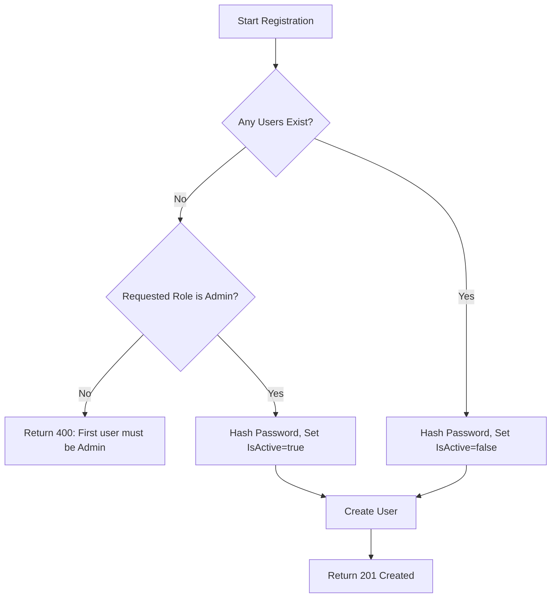
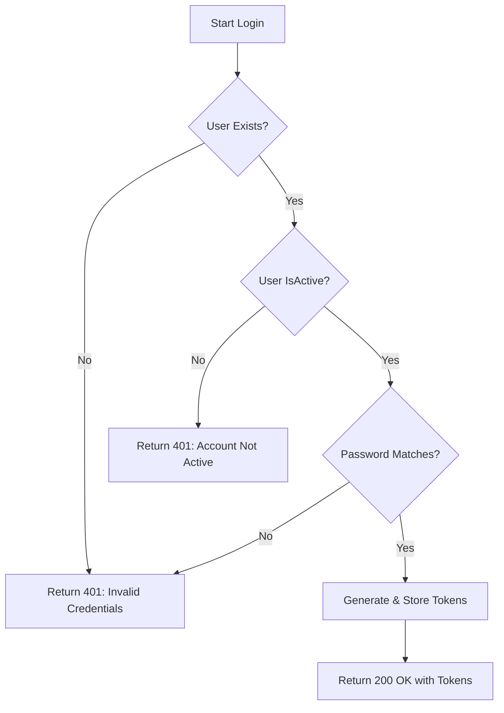
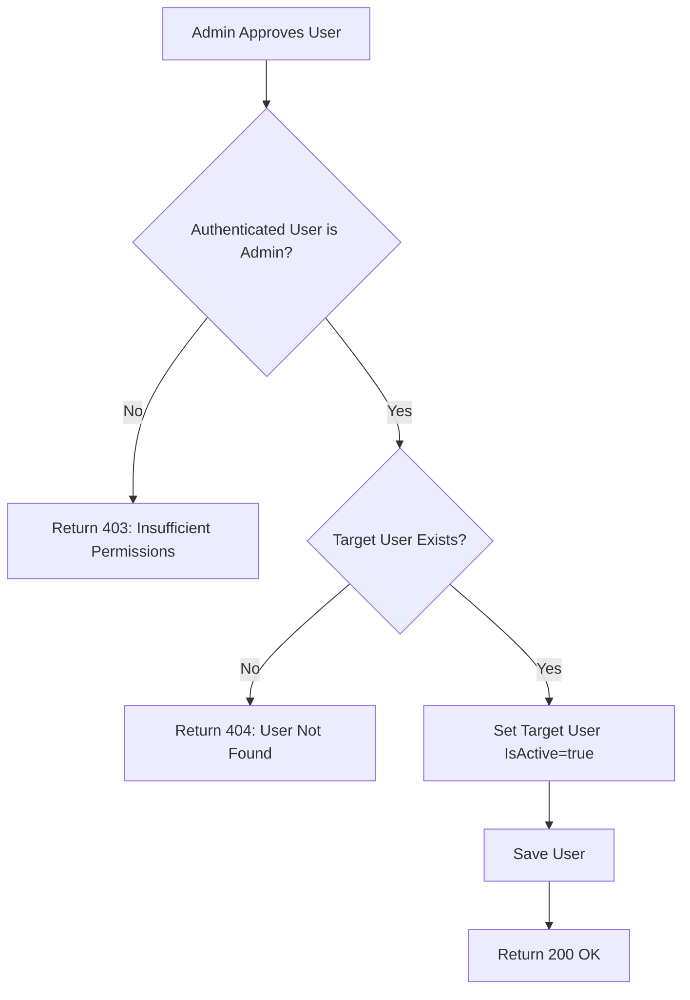
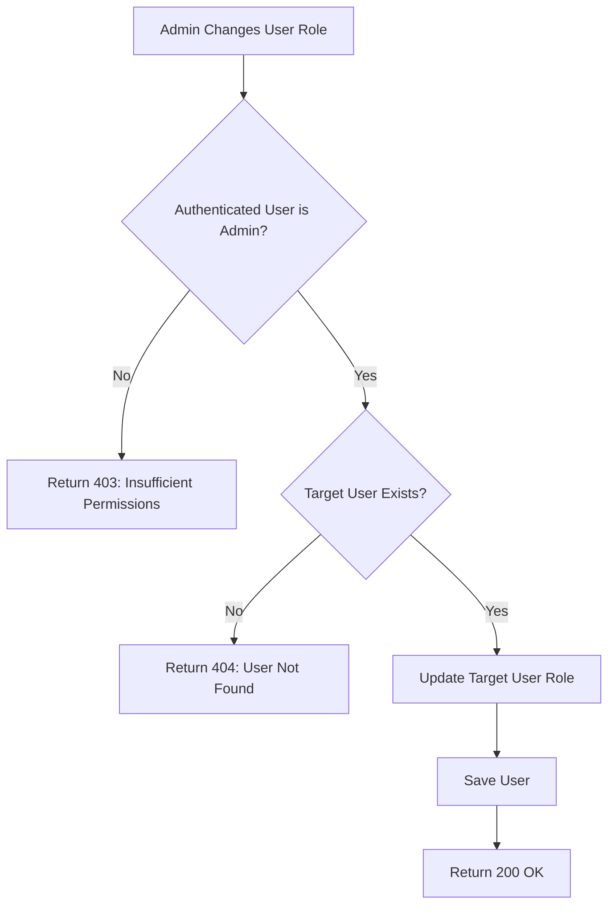
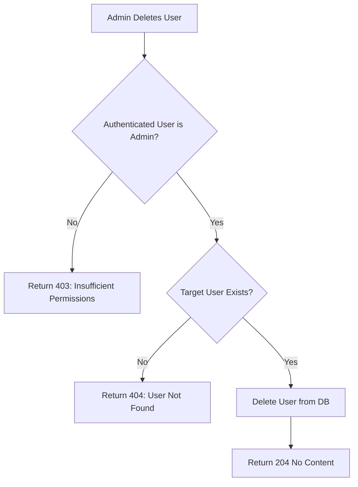
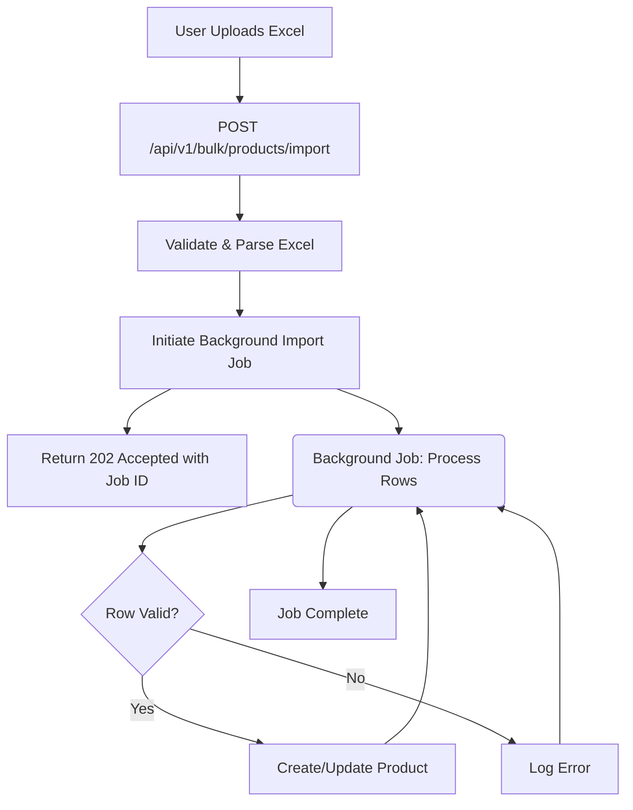

# Business Logic Details

This document outlines the detailed business logic for the Quantify backend, organized by feature and scenario, including process flows visualized with Mermaid diagrams.

## 1. User Management

### 1.1 User Registration

**Scenario: First User Registration (Admin)**
-   **Pre-condition**: No users exist in the system.
-   **Process**:
    1.  User sends a `POST /api/v1/users/register` request with `username`, `password`, and `role`.
    2.  System checks if any users exist.
    3.  If no users exist, the system enforces that the `role` must be "Admin".
    4.  If `role` is "Admin", the password is hashed, `IsActive` is set to `true`, and the user is created.
    5.  System returns `HTTP 201 Created` with user details (password omitted).
-   **Post-condition**: A new active "Admin" user is created.
-   **Error Cases**:
    -   If `role` is not "Admin", system returns `HTTP 400 Bad Request`.

**Scenario: Subsequent User Registration (Admin, Manager, Staff)**
-   **Pre-condition**: At least one user (an Admin) already exists in the system.
-   **Process**:
    1.  User sends a `POST /api/v1/users/register` request with `username`, `password`, and `role`.
    2.  System checks if any users exist.
    3.  If users exist, the password is hashed, `IsActive` is set to `false` (regardless of role), and the user is created.
    4.  System returns `HTTP 201 Created` with user details (password omitted).
-   **Post-condition**: A new inactive user is created. This user requires approval by an existing Admin to become active.

### 1.2 User Login

**Scenario: Successful Login**
-   **Pre-condition**: User exists and `IsActive` is `true`.
-   **Process**:
    1.  User sends a `POST /api/v1/users/login` request with `username` and `password`.
    2.  System retrieves user by `username`.
    3.  System checks if `IsActive` is `true`.
    4.  System compares provided password with hashed password.
    5.  If passwords match, access and refresh tokens are generated and stored in Redis.
    6.  System returns `HTTP 200 OK` with tokens.
-   **Post-condition**: User is authenticated, tokens are issued.

**Scenario: Failed Login (Inactive User)**
-   **Pre-condition**: User exists but `IsActive` is `false`.
-   **Process**:
    1.  User sends a `POST /api/v1/users/login` request.
    2.  System retrieves user by `username`.
    3.  System checks `IsActive`.
    4.  If `IsActive` is `false`, system returns `HTTP 401 Unauthorized` with a message "Account not active. Please contact an administrator."
-   **Post-condition**: User is not authenticated.

**Scenario: Failed Login (Invalid Credentials)**
-   **Pre-condition**: User exists and `IsActive` is `true`, but password does not match.
-   **Process**:
    1.  User sends a `POST /api/v1/users/login` request.
    2.  System retrieves user by `username`.
    3.  System checks `IsActive` (is true).
    4.  System compares provided password with hashed password.
    5.  If passwords do not match, system returns `HTTP 401 Unauthorized` with a message "Invalid credentials".
-   **Post-condition**: User is not authenticated.

### 1.3 User Approval (Admin Functionality)

**Scenario: Admin Approves User**
-   **Pre-condition**: An inactive user exists. Authenticated user has "Admin" role.
-   **Process**:
    1.  Admin sends a `PUT /api/v1/users/:id/approve` request.
    2.  System authenticates Admin and verifies "Admin" role via `AdminOnly` middleware.
    3.  System retrieves the target user by `id`.
    4.  System sets `IsActive` to `true` for the target user.
    5.  System saves the updated user.
    6.  System returns `HTTP 200 OK` with the updated user details.
-   **Post-condition**: Target user's account is now active.

### 1.4 User Role Management (Admin Functionality)

**Scenario: Admin Changes User Role**
-   **Pre-condition**: Authenticated user has "Admin" role. Target user exists.
-   **Process**:
    1.  Admin sends a `PUT /api/v1/users/:id` request with `role` in the body.
    2.  System authenticates Admin and verifies "Admin" role via `AdminOnly` middleware.
    3.  System retrieves the target user by `id`.
    4.  System updates the `role` field of the target user.
    5.  System saves the updated user.
    6.  System returns `HTTP 200 OK` with the updated user details.
-   **Post-condition**: Target user's role is updated.

### 1.5 User Deletion (Admin Functionality)

**Scenario: Admin Deletes User**
-   **Pre-condition**: Authenticated user has "Admin" role. Target user exists.
-   **Process**:
    1.  Admin sends a `DELETE /api/v1/users/:id` request.
    2.  System authenticates Admin and verifies "Admin" role via `AdminOnly` middleware.
    3.  System retrieves the target user by `id`.
    4.  System deletes the target user from the database.
    5.  System returns `HTTP 204 No Content`.
-   **Post-condition**: Target user is removed from the system.

## 2. Product Management

### 2.1 Product Creation/Update

**Scenario: Create New Product**
-   **Pre-condition**: Authenticated user. Valid product data provided.
-   **Process**:
    1.  User sends `POST /api/v1/products` with product details.
    2.  System validates input.
    3.  System creates a new `Product` record in the database.
    4.  System returns `HTTP 201 Created` with the new product.
-   **Post-condition**: New product is available in the inventory.

**Scenario: Update Existing Product**
-   **Pre-condition**: Authenticated user. Product exists. Valid update data provided.
-   **Process**:
    1.  User sends `PUT /api/v1/products/:id` with updated product details.
    2.  System validates input.
    3.  System retrieves existing `Product` by `id`.
    4.  System updates specified fields of the product.
    5.  System saves the updated `Product` record.
    6.  System returns `HTTP 200 OK` with the updated product.
-   **Post-condition**: Product details are modified.

## 3. Inventory Management

### 3.1 Stock Adjustments

**Scenario: Manual Stock Adjustment (Stock In/Out)**
-   **Pre-condition**: Authenticated user. Valid product and location.
-   **Process**:
    1.  User sends `POST /api/v1/stock/adjustments` with `product_id`, `location_id`, `type` (STOCK_IN/STOCK_OUT), `quantity`, `reason_code`, `notes`.
    2.  System validates input.
    3.  System retrieves current stock for the product at the location.
    4.  System updates the stock quantity based on `type` and `quantity`.
    5.  System creates a `StockAdjustment` record, logging `AdjustedBy`, `PreviousQuantity`, `NewQuantity`.
    6.  System returns `HTTP 201 Created`.
-   **Post-condition**: Stock level is adjusted, and an audit trail is created.

### 3.2 Stock Transfers

**Scenario: Transfer Stock Between Locations**
-   **Pre-condition**: Authenticated user. Valid product, source, and destination locations. Sufficient stock at source.
-   **Process**:
    1.  User sends `POST /api/v1/inventory/transfers` with `product_id`, `source_location_id`, `dest_location_id`, `quantity`.
    2.  System validates input and checks stock availability at source.
    3.  System decrements stock at source location.
    4.  System increments stock at destination location.
    5.  System creates a `StockTransfer` record with `Status: PENDING`.
    6.  System returns `HTTP 201 Created`.
-   **Post-condition**: Stock is moved between locations, transfer recorded.

### 3.3 Alerts (Low Stock, Expiry)

**Scenario: Trigger Low Stock Alert**
-   **Pre-condition**: Product's current stock falls below `LowStockLevel` defined in `ProductAlertSettings`.
-   **Process**:
    1.  (Automated process or manual trigger `POST /api/v1/alerts/check`) System checks product stock levels against `ProductAlertSettings`.
    2.  If stock < `LowStockLevel`, system creates an `Alert` record with `Type: LOW_STOCK`.
    3.  System potentially sends notifications based on `UserNotificationSettings`.
-   **Post-condition**: Low stock alert is recorded and potentially notified.

## 4. Replenishment

### 4.1 Demand Forecasting

**Scenario: Generate Demand Forecast**
-   **Pre-condition**: Authenticated user. Valid product and forecast period.
-   **Process**:
    1.  User sends `POST /api/v1/replenishment/forecast/generate` with `product_id`, `forecast_period`.
    2.  System processes historical data and generates a `PredictedDemand`.
    3.  System creates a `DemandForecast` record.
    4.  System returns `HTTP 201 Created` with the forecast.
-   **Post-condition**: Demand forecast is available for a product.

### 4.2 Reorder Suggestions

**Scenario: List Reorder Suggestions**
-   **Pre-condition**: Authenticated user.
-   **Process**:
    1.  User sends `GET /api/v1/replenishment/suggestions`.
    2.  System analyzes current stock, demand forecasts, and lead times for products.
    3.  System generates `ReorderSuggestion` records for products needing replenishment.
    4.  System returns `HTTP 200 OK` with a list of suggestions.
-   **Post-condition**: List of reorder suggestions is provided.

### 4.3 Purchase Order Lifecycle

**Scenario: Create Purchase Order from Suggestion**
-   **Pre-condition**: Authenticated user. Existing `ReorderSuggestion`.
-   **Process**:
    1.  User sends `POST /api/v1/replenishment/suggestions/:suggestionId/create-po`.
    2.  System retrieves `ReorderSuggestion`.
    3.  System creates a `PurchaseOrder` with `Status: DRAFT` and `PurchaseOrderItem`s based on the suggestion.
    4.  System updates `ReorderSuggestion` status to `PO_CREATED`.
    5.  System returns `HTTP 201 Created` with the new PO.
-   **Post-condition**: A draft Purchase Order is created.

**Scenario: Approve Purchase Order**
-   **Pre-condition**: Authenticated user (with appropriate role, e.g., Manager/Admin). Existing `PurchaseOrder` with `Status: DRAFT`.
-   **Process**:
    1.  User sends `POST /api/v1/replenishment/purchase-orders/:poId/approve`.
    2.  System authenticates user and checks role.
    3.  System retrieves `PurchaseOrder`.
    4.  System updates `PurchaseOrder` `Status: APPROVED`, sets `ApprovedBy` and `ApprovedAt`.
    5.  System returns `HTTP 200 OK`.
-   **Post-condition**: Purchase Order is approved.

**Scenario: Receive Purchase Order**
-   **Pre-condition**: Authenticated user. Existing `PurchaseOrder` with `Status: SENT` or `PARTIALLY_RECEIVED`.
-   **Process**:
    1.  User sends `POST /api/v1/replenishment/purchase-orders/:poId/receive` with received quantities for items.
    2.  System validates input.
    3.  System updates `ReceivedQuantity` for `PurchaseOrderItem`s.
    4.  System increments stock levels for received products.
    5.  If all items received, `PurchaseOrder` `Status: RECEIVED`. If partial, `Status: PARTIALLY_RECEIVED`.
    6.  System returns `HTTP 200 OK`.
-   **Post-condition**: Stock levels updated, PO status updated.

## 5. Bulk Operations

### 5.1 Product Import

**Scenario: Bulk Import Products via Excel**
-   **Pre-condition**: Authenticated user. Valid Excel file with product data.
-   **Process**:
    1.  User uploads Excel file to `POST /api/v1/bulk/products/import`.
    2.  System receives file, parses it, and validates data.
    3.  System initiates a background job for import.
    4.  System returns `HTTP 202 Accepted` with a `jobId`.
    5.  (Background Job) System processes each row: creates new products or updates existing ones.
    6.  (Background Job) Logs success/failure for each row.
-   **Post-condition**: Products are imported/updated, and a job status is available.

### 5.2 Product Export

**Scenario: Bulk Export Products to Excel**
-   **Pre-condition**: Authenticated user.
-   **Process**:
    1.  User sends `GET /api/v1/bulk/products/export`.
    2.  System retrieves all product data.
    3.  System generates an Excel file.
    4.  System returns `HTTP 200 OK` with the Excel file as a download.
-   **Post-condition**: User receives an Excel file containing product data.

This document provides a detailed overview of the business logic implemented in the Quantify backend.
