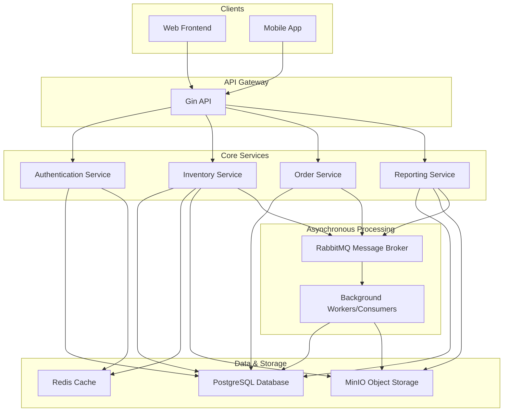

# Quantify: Full Project Analysis and Business Logic Deep Dive

## Introduction

This document provides a comprehensive analysis of the "Quantify" inventory management system. It covers the core business logic, a deep dive into each feature, and a thorough analysis of the current state of the codebase, highlighting gaps and providing recommendations to make the application production-grade.

## Architecture Overview

Quantify is an event-driven inventory management system with a microservices-inspired architecture. It is composed of several key components that work together to provide a robust and scalable solution:

*   **API (Gin):** A RESTful API built with the Gin framework serves as the main entry point for all client interactions.
*   **Database (PostgreSQL with GORM):** A PostgreSQL database is used as the persistent data store for all business objects. GORM is used as the ORM for database interactions.
*   **Message Broker (RabbitMQ):** RabbitMQ is used for asynchronous communication between services, particularly for background job processing (e.g., bulk operations, reporting).
*   **Cache (Redis):** Redis is used for caching frequently accessed data and for session management (storing JWTs).
*   **Object Storage (MinIO):** MinIO is used for storing large files, such as those generated by bulk operations and reports.
*   **WebSockets:** WebSockets are used for real-time communication with clients, pushing updates and notifications.

## Business Logic Deep Dive and Production Readiness Analysis

### 1. User Management & Authentication

**Business Logic:**
The application provides a comprehensive user management system with role-based access control (RBAC). Users can register, log in, and manage their sessions using JWTs and refresh tokens. The system supports "Admin", "Manager", and "Staff" roles, with admins having the ability to approve new user registrations.

**Production Readiness Analysis:**
*   **Gaps:**
    *   **Incomplete Input Validation:** The user registration endpoint could benefit from more robust validation (e.g., password complexity).
    *   **Potential for IDOR:** While the `AdminOnly` middleware is used for some user management endpoints, there isn't a consistent check to ensure a user is only updating their own information unless they are an admin.
    *   **Hardcoded User IDs:** Some handlers use hardcoded user IDs (e.g., `CreatedBy: 1`), which should be replaced with the authenticated user's ID from the context.
*   **Recommendations:**
    *   Implement more stringent password policies and input validation.
    *   Add authorization checks to all user-related endpoints to prevent IDOR vulnerabilities.
    *   Replace all hardcoded user IDs with the authenticated user's ID.

### 2. Product Management

**Business Logic:**
The core of the application revolves around product management. Users can create, view, update, and delete products, organize them into categories and sub-categories, and associate them with suppliers and locations.

**Production Readiness Analysis:**
*   **Gaps:**
    *   **Inconsistent Caching:** The caching strategy for products is inconsistent. Some endpoints use caching, while others don't. Cache invalidation is also not handled consistently.
    *   **N+1 Queries:** The `ListProducts` endpoint, while it uses `Preload`, could still be inefficient for large datasets.
*   **Recommendations:**
    *   Implement a consistent caching strategy for all product-related endpoints.
    *   Thoroughly analyze and optimize database queries to prevent N+1 issues, especially in list views.

### 3. Stock Management

**Business Logic:**
The system provides detailed stock management, allowing users to track stock in batches, perform manual adjustments, and transfer stock between locations. This is crucial for maintaining accurate inventory levels.

**Production Readiness Analysis:**
*   **Gaps:**
    *   **Missing Transactions:** The `CreateStockAdjustment` function attempts to use a transaction, but the logic within is complex and could be prone to errors. Other stock-related operations may also be missing transactions where they are needed.
    *   **Simplified Stock Reduction Logic:** The logic for reducing stock in the `CreateStockAdjustment` function is simplified and may not be suitable for a production environment that requires strict FIFO/LIFO/FEFO logic.
*   **Recommendations:**
    *   Wrap all atomic stock operations in database transactions to ensure data integrity.
    *   Implement a more robust stock reduction logic based on the desired inventory accounting method (FIFO, LIFO, etc.).

### 4. Asynchronous Job Processing (Bulk Operations & Reporting)

**Business Logic:**
The application uses RabbitMQ to process long-running tasks like bulk data import/export and report generation asynchronously. This ensures the API remains responsive and can handle time-consuming operations without blocking.

**Production Readiness Analysis:**
*   **Gaps:**
    *   **Potential Race Conditions:** The `RabbitMQManager` has potential race conditions in its connection handling logic.
    *   **No Graceful Shutdown:** The application lacks a graceful shutdown mechanism for background workers, which could lead to data loss or corruption if the application is suddenly terminated.
    *   **Single Consumer Instance:** Only a single instance of the message consumer is started, which could become a bottleneck.
*   **Recommendations:**
    *   Refactor the `RabbitMQManager` to use proper locking and avoid race conditions.
    *   Implement a graceful shutdown mechanism to allow background workers to finish their current tasks before exiting.
    *   Design the application to allow for multiple consumer instances to be run for better scalability.

### 5. Alerts & Notifications

**Business Logic:**
The system can be configured to trigger alerts for events like low stock, overstock, and expiring products. It can also send notifications to users via email.

**Production Readiness Analysis:**
*   **Gaps:**
    *   **Cron-based Alerting:** The alerting mechanism is based on a cron job that runs every 5 minutes. This might not be real-time enough for some use cases and could be inefficient.
    *   **Limited Notification Channels:** The system only supports email notifications.
*   **Recommendations:**
    *   Consider an event-driven approach for triggering alerts, which would be more real-time and efficient.
    *   Add support for other notification channels like SMS, push notifications, or integrations with platforms like Slack.

## Overall Production Readiness Gaps and Recommendations

### 1. Configuration Management
*   **Problem:** Configuration is not flexible and relies on hardcoded defaults, making local development and deployment to different environments difficult.
*   **Recommendation:** Use a more robust configuration management library and provide environment-specific configuration files. Use a secret management system for production secrets.

### 2. Error Handling
*   **Problem:** Error handling is inconsistent, and errors are not always logged with sufficient detail.
*   **Recommendation:** Enforce a consistent error handling strategy, use structured logging for all errors, and ensure all errors are handled properly.

### 3. Security
*   **Problem:** The application has several potential security vulnerabilities, including incomplete input validation, potential for IDOR, and lack of CSRF protection.
*   **Recommendation:** Conduct a thorough security audit of the codebase, implement comprehensive input validation, add authorization checks to all endpoints, and implement CSRF protection.

### 4. Testing
*   **Problem:** The application has no tests.
*   **Recommendation:** Add a comprehensive test suite covering all parts of the application, including unit, integration, and end-to-end tests.

### 5. Observability
*   **Problem:** The application has limited observability features.
*   **Recommendation:** Implement consistent, structured logging, add distributed tracing, and create custom metrics for key application events.

### 6. Database
*   **Problem:** Database access is not always done through the repository layer, and some operations that should be atomic are not wrapped in a transaction.
*   **Recommendation:** Refactor all database access to go through the repository layer, use transactions for all atomic operations, and analyze and optimize database queries.

### 7. Code Structure and Maintainability
*   **Problem:** The `main.go` file is too large and has too many responsibilities, and the code is sparsely commented.
*   **Recommendation:** Refactor `main.go` to move initialization and consumer logic into separate packages, and add comments to the code to improve readability and maintainability.
